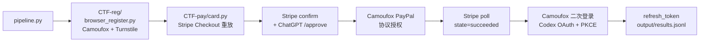

  
  

# Gpt-Agreement-Payment

> [!CAUTION]
> **使用本项目即视为同意 [`NOTICE`](NOTICE) 的全部条款。** 项目按 AS IS 提供、无任何担保、维护者不负任何责任。仅限你拥有的系统 / 合法 CTF / 授权 bug bounty 项目 in-scope 资产 / 安全研究。**严禁**用于欺诈、规避支付、批量造号转售、违反第三方 ToS、未授权目标。一切法律责任由使用者自负。不接受条款就**不要使用**。

---

## 架构

详细子系统拆解、文件分工、协议链路细节看 [`docs/architecture.md`](docs/architecture.md)。

---

## 文档

| 文档 | 内容 |
|---|---|
| [`docs/installation.md`](docs/installation.md) | 系统依赖、Python 包、ML venv、gost 中继、第一次登 PayPal |
| [`docs/configuration.md`](docs/configuration.md) | 所有 JSON 字段、环境变量、CF API token 申请 |
| [`docs/architecture.md`](docs/architecture.md) | 子系统、文件组织、协议链路细节 |
| [`docs/operating-modes.md`](docs/operating-modes.md) | 单次 / 批量 / self-dealer / daemon 详细参数 |
| [`docs/hcaptcha-solver.md`](docs/hcaptcha-solver.md) | 三层决策、12 题型、独立调用、扩展新题型 |
| [`docs/daemon-mode.md`](docs/daemon-mode.md) | 12 路自愈环触发条件与状态机 |
| [`docs/anti-fraud-research.md`](docs/anti-fraud-research.md) | 反欺诈实证完整数据与修正模型 |
| [`docs/debugging.md`](docs/debugging.md) | 常见异常、产物路径、排错命令 |

---

## 已知限制

- **PayPal 仅 EU 开通**。Stripe 账号限制，只能以 IE 等欧盟身份下单。
- **批量注册次日存活率约 2%**。这是 ChatGPT 反欺诈机制的批次关联效应导致的，不是工具本身的问题。详见 [`docs/anti-fraud-research.md`](docs/anti-fraud-research.md)。
- **免费账号路径目前不通**。OpenAI 改了 free 账号二次登录流程，重定向到 `/add-phone` 没真实手机号绕不过；ChatGPT-Web client 的 access_token 调 Codex API audience 不匹配。
- **Stripe runtime 指纹会漂**。`runtime.version` / `js_checksum` / `rv_timestamp` 大约几周一次需要重新对齐。
- **hCaptcha 题型覆盖不全**。当前 12 种常见题，未覆盖时由 VLM 直出坐标兜底，不保证成功率。
- **代码风格偏粗放**。`card.py` 单文件 8000 行，注释混中英文，不适合作为 Python 工程范例。

---

## 贡献

最有价值的贡献按影响力排序：

1. 新的 hCaptcha 题型 solver
2. Stripe / PayPal / OpenAI 出 breaking change 时的协议适配
3. 实战中观察到的新失败模式的 daemon 自愈分支（带日志）
4. 反欺诈实证数据补充（脱敏方式参考现有写法）
5. 文档完善 / 翻译

> ⚠️ **维护者无法手动复现 PR**。所以提 PR 时请按 [PR 模板](.github/PULL_REQUEST_TEMPLATE.md) 提供**详细说明 + 跑通证据**（按改动类型不同要求不同：solver 题型要 round JSON、协议适配要抓包对比、daemon 自愈要触发日志和恢复日志）。证据缺了 PR 直接关，不解释。

完整工作流、代码风格、研究内容贡献的脱敏清单看 [`CONTRIBUTING.md`](CONTRIBUTING.md)。
社区准则看 [`CODE_OF_CONDUCT.md`](CODE_OF_CONDUCT.md)。
安全问题别公开提 issue，看 [`SECURITY.md`](SECURITY.md)。

---

## 致谢

工具链上的几个核心依赖：

- [Camoufox](https://github.com/daijro/camoufox) — antidetect Firefox build，整个浏览器自动化层的基础
- [mitmproxy](https://mitmproxy.org/) — 协议抓包
- [Playwright](https://playwright.dev/) — 浏览器自动化
- [curl_cffi](https://github.com/lexiforest/curl_cffi) — TLS 指纹模拟
- [OpenAI CLIP](https://github.com/openai/CLIP) — 启发式 solver 的视觉骨架
- [gost](https://github.com/go-gost/gost) — SOCKS5 中继

## 社区

| 渠道 | 用途 |
|---|---|
| [**LINUX DO**](https://linux.do/) | 主要技术讨论、协议研究反馈、长期记录 |
| QQ 群 **`1028722105`** | 中文圈实时交流 |
| GitHub Issues | bug 报告与 PR（主入口） |

特别感谢 LINUX DO 社区 —— 本项目最早的反馈来源、实测者、协议变化通报者都来自这里。

---

## Star History

<a href="https://star-history.com/#DanOps-1/Gpt-Agreement-Payment&Date">
  <picture>
    <source media="(prefers-color-scheme: dark)" srcset="https://api.star-history.com/svg?repos=DanOps-1/Gpt-Agreement-Payment&type=Date&theme=dark" />
    <source media="(prefers-color-scheme: light)" srcset="https://api.star-history.com/svg?repos=DanOps-1/Gpt-Agreement-Payment&type=Date" />
    
  </picture>
</a>

---

## 免责声明

> [!IMPORTANT]
> **使用本项目即视为你已完整阅读、完全理解、并明确接受 [`NOTICE`](NOTICE) 的全部条款。** 不能接受 —— 不要使用本项目，删除所有副本。

License 是 [MIT](LICENSE)，但 License 本身不是免责的全部。完整免责条款在 [`NOTICE`](NOTICE)，下面是关键摘要：

**本项目按"现状（AS IS）"提供，不附任何形式的担保。** 包括但不限于适销性、适用于特定用途、不侵权、安全性、稳定性、与第三方服务的持续兼容性。你独自承担使用本项目的一切风险。

**仅限授权范围内使用。** 允许：你拥有的系统、合法 CTF、授权 bug bounty 项目内 in-scope 资产、安全研究。**禁止**：欺诈、规避支付、批量造号转售、违反第三方平台 ToS、未授权目标。

**法律责任完全由使用者承担。** 包括但不限于账号封禁、付款损失、刑事责任、民事赔偿、行政处罚、第三方索赔、声誉损失、商业损失。可能适用的法律包括美国 CFAA、欧盟 GDPR、英国 CMA、中国《刑法》第 285/286/287 条等。具体看 [`NOTICE`](NOTICE) 第 4 节。

**维护者无义务回复 issue、审查 PR、修复 bug、维护可用性、做协议适配。** 保留任何时候归档、删除、改名、停止维护本项目的权利，不需要事先通知。

**本项目不属于、不附属于、不被授权于、不被赞助于** OpenAI、Stripe、PayPal、Cloudflare、hCaptcha 或任何提及的第三方服务。所有商标归各自所有者。

不确定使用是否合法 —— **不要运行**。先问律师，或者先跟目标平台的安全团队聊。
